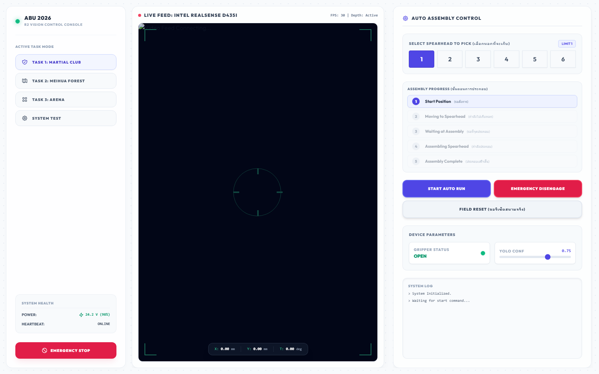
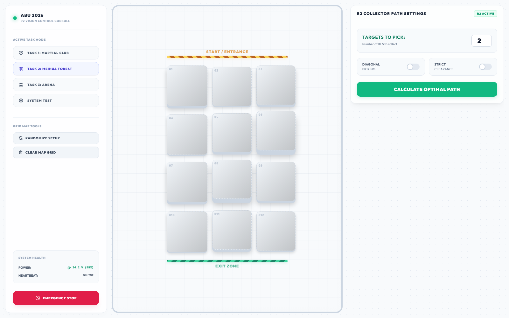
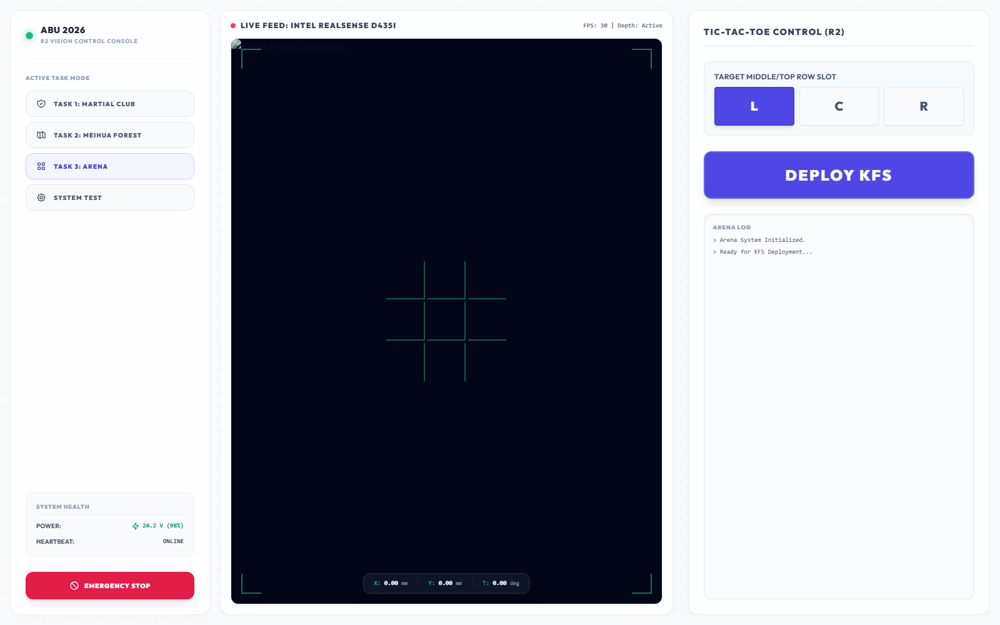
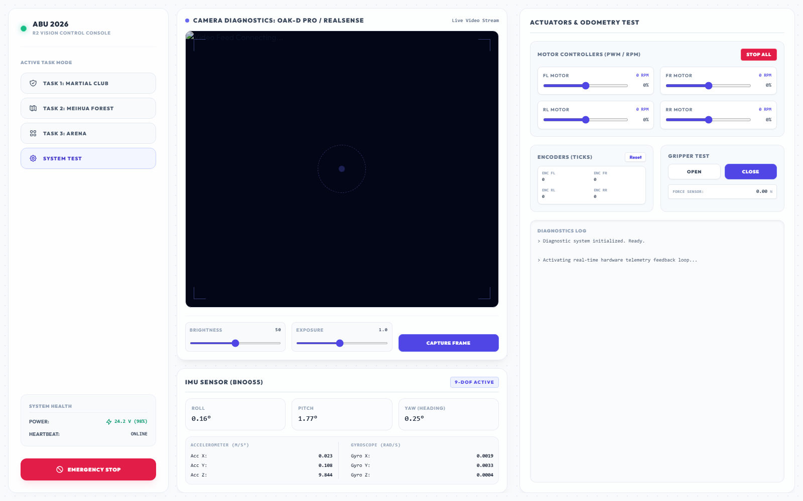

# ระบบควบคุมและแสดงผลหุ่นยนต์ R2 (ABU Robocon 2026)

หน้าจอ Operator UI (Dashboard) สำหรับควบคุมและมอนิเตอร์สถานะการทำงานของหุ่นยนต์ R2 ในการแข่งขัน ABU Robocon 2026 ตัวโปรแกรมรันด้วย Python Flask ส่วนหน้าเว็บเขียนด้วย HTML, Vanilla CSS และ TailwindCSS ออกแบบสไตล์ธีมสว่าง (Light Theme) ให้ดูสะอาดตา สบายตา จัดวางข้อมูลเป็นระเบียบ และใช้งานง่ายในสนามแข่งจริง

---

## 🤖 ลำดับการทำงานของหุ่นยนต์ R2 (R2 Workflow)

หุ่นยนต์ R2 จะทำงานร่วมกับตัวหน้าจอโปรแกรมนี้ โดยมี UI เป็นตัวกลางในการส่งรับคำสั่งและแชร์ข้อมูลพิกัด (Telemetry) ระหว่างโปรแกรมหลักของหุ่นยนต์กับคนคุม (Operator):

### 🗡️ Task 1: เก็บหอกและประกอบ (Martial Club)
1. **ตั้งหุ่น:** นำหุ่น R2 ไปตั้งไว้ที่จุด Start ในสนาม
2. **เลือกหอก:** Operator กดเลือกหอกที่ต้องการเก็บผ่านหน้าโปรแกรม (เลือกหมายเลขหอก 1 - 6)
3. **กด Auto:** Operator กดปุ่ม `START AUTO RUN` บนหน้าจอ
   * ระบบ Auto จะสั่งให้หุ่นวิ่งตามเส้นทางที่กำหนดเพื่อไปจอดใกล้กับหอกที่เลือกไว้ที่สุด
   * เมื่อไปถึงตำแหน่ง หุ่นยนต์จะเปิดกล้องตรวจจับตำแหน่งหัวหอกด้วยโมเดล YOLO และปรับทิศทางล้อ (Adjust) ให้ตรงกับหัวหอกเป้าหมายโดยอัตโนมัติ
   * เมื่อจัดแนวตรงแล้ว กริปเปอร์จะหนีบจับหัวหอก (สถานะการคีบของ Gripper บนหน้าจอจะอัปเดตแบบเรียลไทม์)
   * เมื่อเก็บหอกเสร็จ หุ่นยนต์จะวิ่งไปยังจุดประกอบหอก (Assembly Position) ที่เซ็ตพิกัดเอาไว้
4. **ประกอบ:** หุ่น R2 จอดรอสแตนด์บายจนกระทั่งทีมประกอบเสียบต่ออุปกรณ์เสร็จเรียบร้อย จากนั้นสามารถกด `FIELD RESET` บนหน้าจอเพื่อเริ่มรอบถัดไปได้ทันที

### 🌸 Task 2: โซนป่าเหมยฮวา (Meihua Forest)
* หน้านี้ใช้แสดงภาพสแกนและพิกัดแผนที่ Grid แบบสดๆ ในสนาม
* Operator สามารถคลิกเปลี่ยนประเภทพื้นที่หรือสลับช่องบน Grid (EMPTY, Target, Hazard) ได้โดยตรงทันทีแบบสะดวกๆ ไม่ต้องคอยกดเปิด/ปิดโหมดแก้ไขให้ยุ่งยาก

### 🎰 Task 3: โซนติ๊กแท็กโท (Tic-Tac-Toe)
* Operator เลือกช่องที่ต้องการเอาอุปกรณ์ KFS ไปวาง (Left, Center, Right)
* หากตรวจเจอว่าช่องเป้าหมายถูกฝั่งตรงข้ามวางแย่งไปแล้ว ตัวโปรแกรมจะมีฟังก์ชัน **Vacant Slot Conflicting** คอยเช็คและสลับตำแหน่งขับไปวางในช่องสำรองที่ยังว่างอยู่อย่างอัตโนมัติทันที

---

## 🖼️ หน้าตาโปรแกรมแต่ละส่วน (UI Screenshots)

ระบบหน้าจอนี้ผ่านการปรับดีไซน์ใหม่ให้ดูสะอาด สบายตา ลบข้อมูลที่ซ้ำซ้อนออก และเพิ่มหน้าทดสอบระบบโดยเฉพาะ:

### 1. หน้าจอหลักคุมทาสก์ 1 (Auto Assembly)
ไว้เลือกหมายเลขหอกที่จะเก็บ ดูสเต็ปขั้นตอนการทำงาน 1 - 5 และสถานะตัวหนีบกริปเปอร์


### 2. หน้าจอพรีวิวมุมมองกล้องและแผนที่ Grid (Task 2)
ไว้ดูภาพตรวจจับรอบสนามพร้อมศูนย์เล็งเป้า และแก้ไขข้อมูลบล็อกสิ่งกีดขวาง


### 3. หน้าจอจัดการสนามติ๊กแท็กโท (Task 3)
แสดงบล็อกกระดานติ๊กแท็กโท พร้อมบันทึกข้อความล็อกประวัติการเคลื่อนที่นำทาง


### 4. หน้าทดสอบอุปกรณ์ฮาร์ดแวร์ (System Test Diagnostics)
หน้ารวมการเช็คระบบย่อยของหุ่นยนต์ ทั้งทดสอบบิดสปีดมอเตอร์, เช็คความเร็ว RPM, รีเซ็ตจำนวน Ticks ของ Encoder ล้อ, ตรวจวัดแรงบีบหัวคีบ, และมอนิเตอร์ตัวเลข IMU 9-DOF


---

## 🚀 วิธีการรันโปรแกรมขึ้นมาใช้งาน (Getting Started)

### 1. ลง Library ที่จำเป็น
แนะนำให้ลงผ่าน Python 3.8+ โดยรันคำสั่งติดตั้ง dependencies:
```bash
pip install -r requirements.txt
```

### 2. รันโปรแกรมหลัก
สั่งรันสคริปต์ Python ในโฟลเดอร์โปรเจกต์:
```bash
python main.py
```

### 3. เปิดหน้าจอ UI
เปิดเว็บบราวเซอร์แล้วเข้าไปที่ลิงก์:
```text
http://localhost:5000
```

---

## 🔌 แนวทางการนำไปต่อสายจริง (ROS & Robot Integration)

เพื่อช่วยให้ทีมวิชั่น (YOLO) และทีมบอร์ดคุมหุ่นยนต์เชื่อมระบบเข้าด้วยกันได้สะดวก แนะนำให้ใช้วิธีสื่อสารผ่าน API ของเว็บบอร์ดดังนี้:

### 1. ส่งพิกัดและตำแหน่งปัจจุบันของตัวรถ
ให้เขียน Node ใน ROS (หรือสคริปต์ควบคุมหลัก) คอยอ่านค่า Odometry แล้วยิง HTTP POST มาอัปเดตหน้าจอเรื่อยๆ ทุกๆ 50ms - 100ms:
```python
import requests

requests.post("http://localhost:5000/api/telemetry", json={
    "x": pose_x_mm,      # พิกัดแนวแกน X (มิลลิเมตร)
    "y": pose_y_mm,      # พิกัดแนวแกน Y (มิลลิเมตร)
    "theta": yaw_degree  # องศาแนวการหันของหน้าหุ่น (องศา)
})
```

### 2. คอยรับฟังคำสั่งจากหน้าจอ (Command Polling)
สคริปต์ที่วิ่งคุมมอเตอร์หรือชุดคำสั่งการเคลื่อนที่ ให้วนลูปยิง GET มาอ่านคำสั่งจากหน้าจอ เพื่อดูว่ามีคนกดปุ่มเริ่มทำงานหรือปุ่มหยุดฉุกเฉินแล้วหรือยัง:
```python
import requests
import time

while True:
    try:
        res = requests.get("http://localhost:5000/api/control").json()
        cmd = res["latest_command"]          # ค่าจะเป็น "START", "DISENGAGE", "RESET"
        spear_num = res["selected_spearhead"] # หมายเลขหอกที่เลือกไว้บนจอ (1 - 6)
        
        if cmd == "START":
            # สั่งหุ่นยนต์วิ่งไปตำแหน่งหอกเบอร์ spear_num
            start_auto_run(spear_num)
        elif cmd == "DISENGAGE":
            # สั่งหยุดมอเตอร์ล้อและชุดกลไกทันที!
            emergency_stop()
    except Exception:
        pass
    time.sleep(0.1)
```

### 3. รายงานขั้นตอนการทำงานให้หน้าจอดู (Step Updates)
เมื่อหุ่นยนต์เคลื่อนไหวหรือเคลียร์งานแต่ละขั้นในสนามเสร็จ ให้สั่ง POST อัปเดตสเต็ปพาสเพื่อให้ Progress Bar ขยับตามสถานะจริง:
```python
# รายงานขั้นตอนที่ 3: หุ่นเก็บหอกมาจอดรอประกอบแล้ว
requests.post("http://localhost:5000/api/task1/step", json={"step": 3})
```

### 4. เชื่อมกล้องจริงและรันทำนายด้วยโมเดล YOLO
ให้เปิดไฟล์ [main.py](file:///C:/Users/tawan/.gemini/antigravity/scratch/R2-ABU/ABU2026_VISION/main.py) แล้วไปหาฟังก์ชัน `gen_frames()` จากนั้นปลดคอมเมนต์และแก้โค้ดเพื่อดึงสตรีมภาพกล้องมาทำนายผลลัพธ์ผ่านตัวสแกน YOLO:
```python
def gen_frames():
    import cv2
    from ultralytics import YOLO # โหลดไลบรารี YOLO
    
    # โหลดไฟล์โมเดลที่เราเทรนไว้
    model = YOLO("best.pt")
    
    cap = cv2.VideoCapture(0) # สั่งเปิดกล้องหลัก หรือ RealSense
    while True:
        success, frame = cap.read()
        if not success:
            break
        else:
            # รันเฟรมผ่านโมเดล YOLO
            results = model(frame)
            annotated_frame = results[0].plot() # วาดขอบ Bounding Box พร้อมค่าเป้าเล็ง
            
            ret, buffer = cv2.imencode('.jpg', annotated_frame)
            yield (b'--frame\r\n'
                   b'Content-Type: image/jpeg\r\n\r\n' + buffer.tobytes() + b'\r\n')
```
เมื่อเขียนเสร็จ ภาพตรวจจับแบบมีกรอบ Bounding Box จะถูกส่งสตรีมขึ้นแสดงผลบนหน้าจอ Operators UI ทุกทาสก์โดยออโต้ทันทีครับ!
